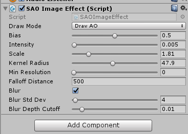
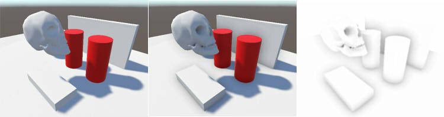

# SAOShaderTest
UnityでのImageEffectのSAO(Scalable Ambient Obscurance)勉強用/覚書です。  
three.jsのexamples/webgl_postprocessing_sao.htmlのShader実装を移植したものになります。  

## 作成環境

Unity 2017.2.0f3

## 使い方

SAOShaderTest/SAOShaderTestフォルダをUnityで読み込みます。  
Assets/test.unityがサンプルシーンです。  
「Assets/SAOShader」がSAO関連のソース一式になります。他のプロジェクトで使用する場合は、これをコピーします。  

Unity Editorでは、Cameraに対して「Scripts」-「SAO Image Effect」をAdd Componentで追加します。  

「Draw Mode」で「Draw Default」を選択すると何もしません。  
「Draw AO」を選択すると、AOの結果をレンダリングにかぶせます。  
「Draw AO Only」を選択すると、AOの結果だけを表示します。  
以下は左から、「Draw Default」「Draw AO」「Draw AO Only」の結果です。  

「Bias」は、AO計算時に誤差を緩和させる浮かせる距離値。  
「Intensity」は、AOの影響の強さ（いじらないほうがよいです）。  
「Scale」を大きくすると、AOの影響が薄くなります。  
「Kernel Radius」はAOの影響を与える半径です。  
「Min Resolution」は不明。  
「Falloff Distance」は、カメラからの距離によりAOの効果を減衰させます。  
「Blur」をOnにすると、ブラーがかかります。内部的には 2 と固定にしてます。  
「Blur Std Dev」が小さい値の場合は、Z深度の境界が見えにくくなりますがブラーがかかりにくくなります。  
「Blur Depth Cutoff」は不明。  

## 参考にしたプロジェクト

- three.js(https://threejs.org/) : Copyright © 2010-2017 three.js authors [LICENSE_threejs.txt](./LICENSE_threejs.txt).

## ライセンス

This software is released under the MIT License, see [LICENSE.txt](./LICENSE.txt).

骸骨の3Dモデルは、Shade3Dマーケットプレイスの以下のものを使用してます。  

https://shade3d.jp/store/marketplace/ft-lab/skeleton/introduction.html

## TODO

- VRのSingle Passでは正しく動作しません。
- モバイル環境では未検証です。
- Mac環境では未検証です。
